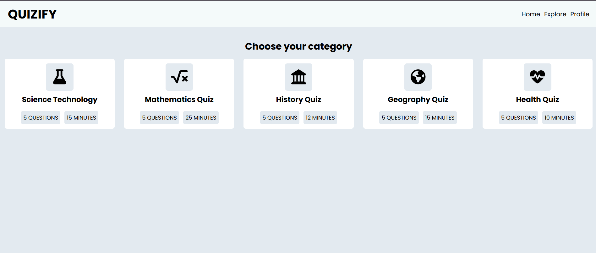
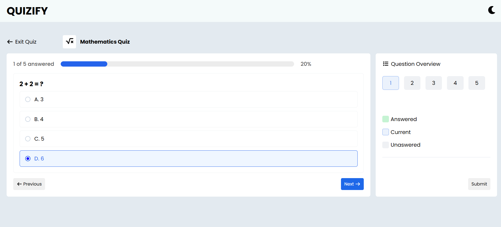
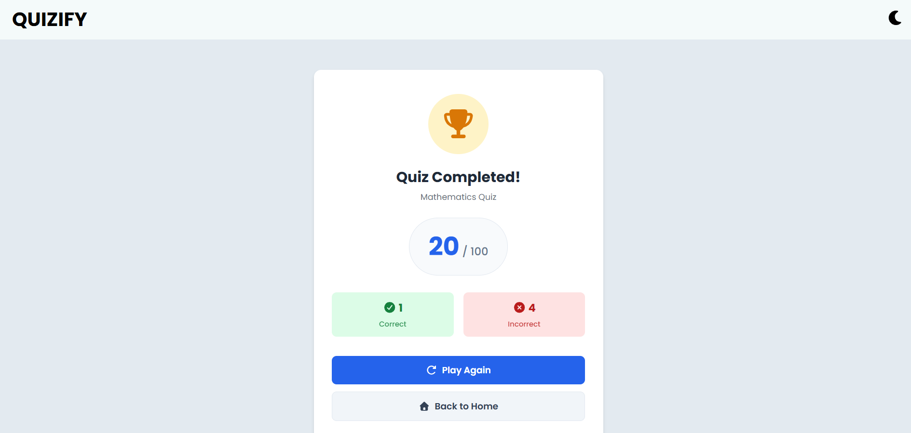

\# Quiz App


A simple and responsive quiz application built using HTML, CSS, and JavaScript.


\## Features


\- Multiple quiz categories

\- Interactive quiz interface

\- Countdown timer

\- Progress tracking

\- Automatic score calculation

\- Result summary page

\- Responsive design

\- Modern UI


\## Pages


\### Dashboard


<p align="center">

&#x20;   

</p>


\### Quiz Page


<p align="center">

&#x20;   

</p>


\### Result Page


<p align="center">

&#x20;   

</p>


Displays:


\- Final score

\- Correct answers

\- Wrong answers

\- Completion percentage


\## Technologies


\- HTML5

\- CSS3

\- JavaScript (ES6)


\## Project Structure


```text

quiz-app/

│

├── dashboard.html

├── index.html

├── quiz.html

├── result.html

│

├── script.js

├── style.css

│

└── README.md

```


\## Getting Started


1\. Download or clone this repository.


```bash

git clone https://github.com/yourusername/quiz-app.git

```


2\. Open:


```text

index.html

```


in your browser.


No installation required.


\## Quiz Flow


1\. Open the landing page.

2\. Select a quiz category.

3\. Answer all questions.

4\. Submit the quiz.

5\. View the final result.


\## Features Implemented


\- Dynamic question rendering

\- Score calculation

\- User answer tracking

\- Category-based quizzes

\- Timer functionality

\- Result statistics


\## Future Improvements


\- Dark mode

\- Local storage support

\- Leaderboard

\- Randomized questions

\- Difficulty levels

\- User authentication


\## Author


Developed by \*\*Adhitya Rizky Ardiansyah\*\*


\## License


MIT License

